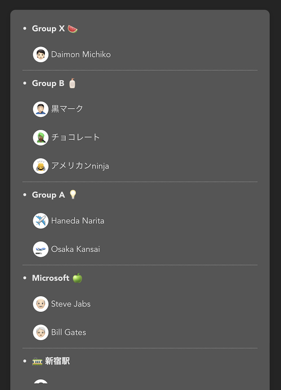
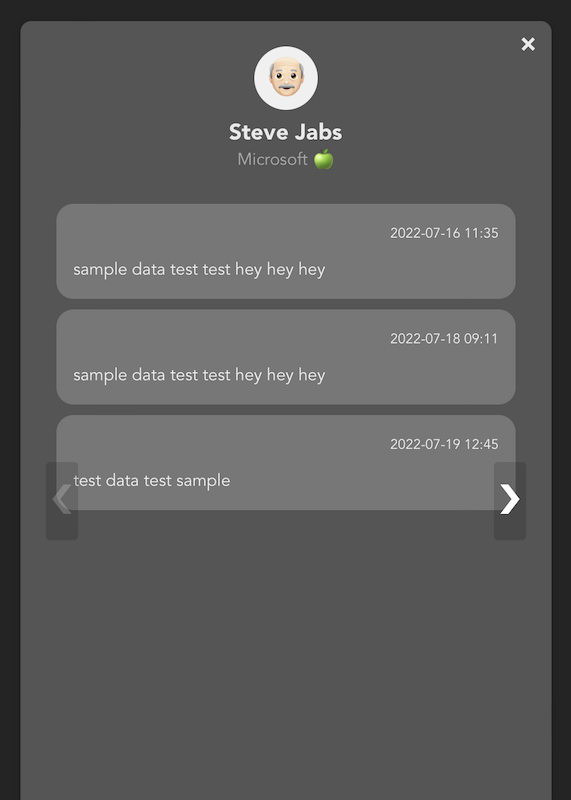

react-query-sample
===========

This React project is bootstrapped using [Vite](https://vitejs.dev/guide/).


# Goal

The primary goal of this project is to get to know react-query.


# The Project

I did not want to make another todo app, so I tried making something different.

I am not actually sure what I ended up making lol.

Basically, there are groups, members under those groups and associated data for each members.

In the Home page, the members will be shown organized by groups.





When the user selects a member, it will go to the Member page to show the associated data for that member.




# Installation

After cloning, go to the project directory and install the required modules

```sh
$ npm install
```

To run the app

```sh
$ npm start
```

